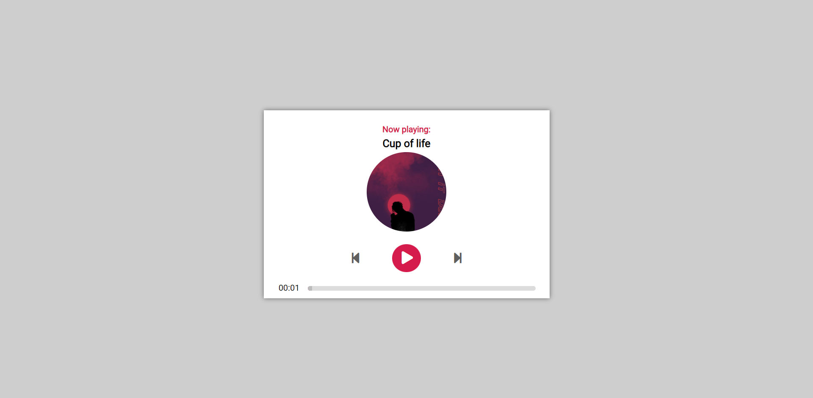
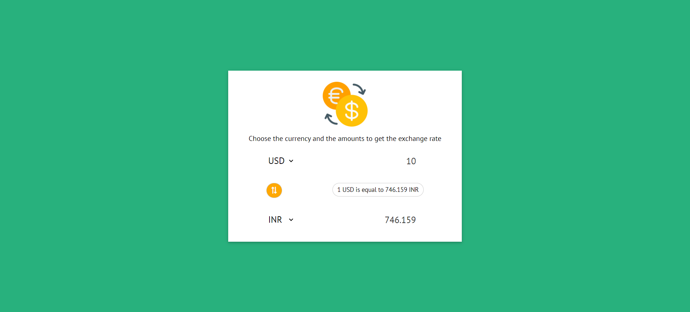
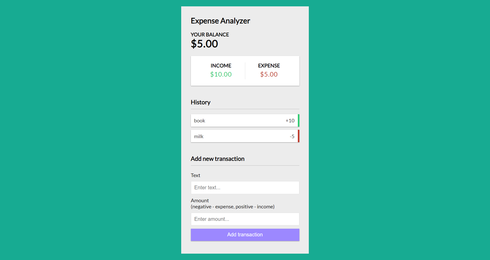

<div align="center">
    <h1>Audio Player</h1>
    <p>This is a simple audio player built with javascript</p>
</div>



<div align="center">
    <h1>Exchange Rate Calulator</h1>
    <p>This is a simple exchange rate calculator built with javascript</p>
</div>



<div align="center">
    <h1>Exchange Rate Calulator</h1>
    <p>This is a simple exchange rate calculator built with javascript</p>
</div>



## Run it on your machine

1. Clone the project

   ```sh
   git clone https://github.com/karthik181194/javascript-projects.git
   ```

2. Run the index.html file

